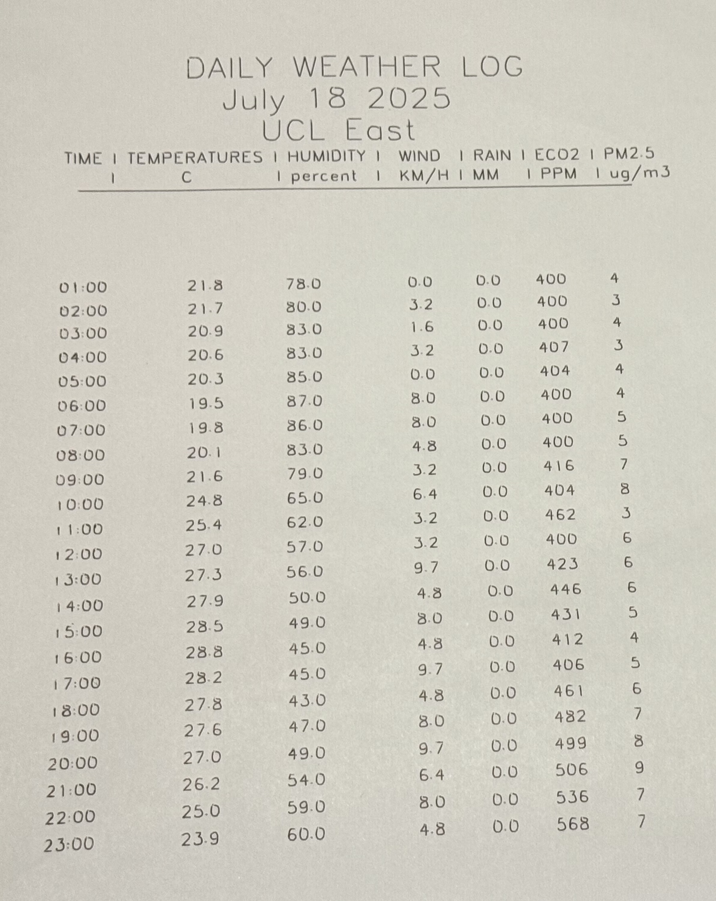

# 🖋️ The Weather Scribe  
---

## 🌦️ Project Description

**The Weather Scribe** ‘writes’ data, updating the weather and air quality data every hour and completing a full daily weather report in text on paper. The system combines motor control with a mechanical structure to automate the writing process. It is equipped with a paper feeding mechanism that automatically advances the paper after each section is completed. The project presents digital ecological data through physical writing to enhance public awareness and understanding of climate and environmental changes.

It is designed to be:
- 🪶 Low-cost
- ♻️ Sustainable  
...while maintaining robustness and automation.

---
## 📷 Project Preview
### Overview

   

### Demonstration

  <video src="https://github.com/user-attachments/assets/0c971a71-63dc-440f-b4bb-f69c3ff8ddf2">
  </video>

 

### Output View

   

---

## 🎯 Key Features

- 📡 Real-time environmental data collection (PM2.5, CO₂, temperature, humidity, wind, rain, etc.)
- 🧠 Structured weather summary generation
- ✍️ SVG to G-code conversion for physical writing
- 📈 Hourly updates and daily headers
- 🖨️ Pen plotter (GRBL-based CNC) output
---
## Hardware List

| Component | Model / Specification | Purpose |
|-----------|-----------------------|---------|
| Main Controller | Raspberry Pi 4 Model B | System control and data processing |
| Motor Driver Board | CNC Shield + A4988 driver modules | Controls stepper motors for writing |
| Stepper Motors | NEMA 17 X 4 | X/Y axis movement |
| Servo Motor | SG90 (or equivalent) | Lifts and lowers the pen |
| Power Supply | 12V 2A DC power | Power for motors and electronics |
| Environmental Sensor |PM5003, SGP30|  PM2.5 and eCO2 data collection |
| Others | Wires, connectors, screws, etc. | Assembly and wiring |

---